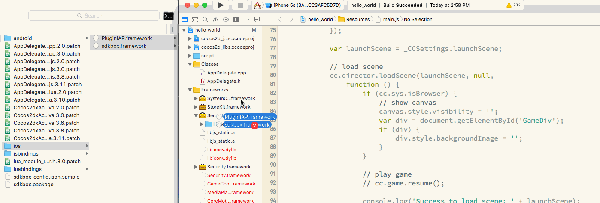

# Cocos Creator v1.1.1 with SDKBox

If you link this repo, please <a class="github-button" href="https://github.com/yinjimmy/ccc_iap_demo" data-icon="octicon-star" data-style="mega" data-count-href="/yinjimmy/ccc_iap_demo/stargazers" data-count-api="/repos/yinjimmy/ccc_iap_demo#stargazers_count" data-count-aria-label="# stargazers on GitHub" aria-label="Star yinjimmy/ccc_iap_demo on GitHub">Star</a> it ;)


## clean codebase

- frameworks/cocos2d-x/external/win32
- android x86 arm64 lib

## iOS

```
open ~/.sdkbox/plugins/sdkbox-iap_v2.2.3.3/plugin/ios/
open build/jsb-default/frameworks/runtime-src/proj.ios_mac/hello_world.xcodeproj/
```



## Android

```
mkdir -p build/jsb-default/frameworks/runtime-src/proj.android/libs/
cp -a ~/.sdkbox/plugins/sdkbox-iap_v2.2.3.3/plugin/android/libs/* build/jsb-default/frameworks/runtime-src/proj.android/libs/
cp -a ~/.sdkbox/plugins/sdkbox-iap_v2.2.3.3/plugin/android/jni/* build/jsb-default/frameworks/runtime-src/proj.android/jni/
```

modify

- [build/jsb-default/frameworks/cocos2d-x/cocos/cocos2d.h](https://github.com/yinjimmy/ccc_iap_demo/commit/d50bd5c9bb67383aa8ac8be74626054c2ea69a79#diff-b3c1658c06ba3903a707f0b16517ae41R33)
- [build/jsb-default/frameworks/runtime-src/Classes/PluginIAPJSHelper.cpp](https://github.com/yinjimmy/ccc_iap_demo/commit/d50bd5c9bb67383aa8ac8be74626054c2ea69a79#diff-df14cc78522f82c4177f4ab65e50ca03R175)
- [build/jsb-default/frameworks/runtime-src/proj.android/jni/Android.mk](https://github.com/yinjimmy/ccc_iap_demo/commit/d50bd5c9bb67383aa8ac8be74626054c2ea69a79#diff-3e845b9bb3a3cc3412915236cc9c6ed3R16)
- [build/jsb-default/frameworks/runtime-src/proj.android/src/org/cocos2dx/javascript/AppActivity.java](https://github.com/yinjimmy/ccc_iap_demo/commit/d50bd5c9bb67383aa8ac8be74626054c2ea69a79#diff-3984758f6350741360984c417d427fe5R39)


## error logs

1.

```
HelloWorld/build/jsb-default/frameworks/runtime-src/Classes/PluginIAPJS.cpp:28:53: No member named 'get' in 'mozilla::Maybe<JS::PersistentRooted<JSObject *> >'
HelloWorld/build/jsb-default/frameworks/runtime-src/Classes/PluginIAPJS.cpp:29:60: No member named 'get' in 'mozilla::Maybe<JS::PersistentRooted<JSObject *> >'
HelloWorld/build/jsb-default/frameworks/runtime-src/Classes/PluginIAPJS.cpp:338:15: No matching function for call to 'jsb_get_js_proxy'
HelloWorld/build/jsb-default/frameworks/runtime-src/Classes/PluginIAPJS.cpp:413:18: No viable overloaded '='
HelloWorld/build/jsb-default/frameworks/runtime-src/Classes/PluginIAPJS.cpp:414:24: No viable overloaded '='
HelloWorld/build/jsb-default/frameworks/runtime-src/Classes/PluginIAPJS.cpp:28:26: No matching constructor for initialization of 'JS::RootedObject' (aka 'Rooted<JSObject *>')
HelloWorld/build/jsb-default/frameworks/runtime-src/Classes/PluginIAPJS.cpp:29:26: No matching constructor for initialization of 'JS::RootedObject' (aka 'Rooted<JSObject *>')
```

the spidermonkey upgraded.

[A] modify [build/jsb-default/frameworks/cocos2d-x/cocos/cocos2d.h](https://github.com/yinjimmy/ccc_iap_demo/commit/d50bd5c9bb67383aa8ac8be74626054c2ea69a79#diff-b3c1658c06ba3903a707f0b16517ae41R33)

```
#define COCOS2D_VERSION 0x00031000
```

lie to SDKBox


2.

```
HelloWorld/build/jsb-default/frameworks/runtime-src/Classes/PluginIAPJSHelper.cpp:175:15: No member named 'scheduleSelector' in 'cocos2d::Scheduler'
```

[A] [scheduleSelector -> schedule](https://github.com/yinjimmy/ccc_iap_demo/commit/d50bd5c9bb67383aa8ac8be74626054c2ea69a79#diff-df14cc78522f82c4177f4ab65e50ca03R175)


3.

```
E/cocos2d-x(21365): ScriptingCore::callFunctionName error:__errorHandler wasn't found!
E/cocos js error:(21365): <no filename="filename"> line:0 msg:too much recursion
```

[A] [build/jsb-default/frameworks/runtime-src/proj.android/jni/Android.mk](https://github.com/yinjimmy/ccc_iap_demo/commit/d50bd5c9bb67383aa8ac8be74626054c2ea69a79#diff-3e845b9bb3a3cc3412915236cc9c6ed3R22) define `LOCAL_CPPFLAGS := -DSDKBOX_ENABLED`


4.

```
I/DEBUG   (23443): [OnPurpose Redunant in void preset_info(aed_report_record*, int, int)] pid: 23411, tid: 23438, name: GLThread 26566  >>> org.cocos2d.hello_world <<<
I/DEBUG   (23443): pid: 23411, tid: 23438, name: GLThread 26566  >>> org.cocos2d.hello_world <<<
I/DEBUG   (23443):     #00 pc 00771c3c  /data/app/org.cocos2d.hello_world-1/lib/arm/libcocos2djs.so (_JavaVM::AttachCurrentThread(_JNIEnv**, void*)+28)
I/DEBUG   (23443):     #01 pc 00772150  /data/app/org.cocos2d.hello_world-1/lib/arm/libcocos2djs.so (sdkbox::JNIUtils::__getEnvAttach()+100)
I/DEBUG   (23443):     #02 pc 00772ac4  /data/app/org.cocos2d.hello_world-1/lib/arm/libcocos2djs.so (sdkbox::JNIUtils::GetJNIStaticMethodInfo(char const*, char const*, char const*, _JNIEnv*)+40)
I/DEBUG   (23443):     #03 pc 0076c320  /data/app/org.cocos2d.hello_world-1/lib/arm/libcocos2djs.so (void sdkbox::JNIInvokeStatic<void, int>(char const*, char const*, int)+64)
I/DEBUG   (23443):     #04 pc 0076beb8  /data/app/org.cocos2d.hello_world-1/lib/arm/libcocos2djs.so (sdkbox::Logger::PlatformInit()+92)
I/DEBUG   (23443):     #05 pc 0076db8c  /data/app/org.cocos2d.hello_world-1/lib/arm/libcocos2djs.so (sdkbox::SdkboxCore::__platformInit()+16)
I/DEBUG   (23443):     #06 pc 0075b5cc  /data/app/org.cocos2d.hello_world-1/lib/arm/libcocos2djs.so (sdkbox::SdkboxCore::SdkboxCore()+248)
I/DEBUG   (23443):     #07 pc 0075b494  /data/app/org.cocos2d.hello_world-1/lib/arm/libcocos2djs.so (sdkbox::SdkboxCore::getInstance()+52)
I/DEBUG   (23443):     #08 pc 0075b3cc  /data/app/org.cocos2d.hello_world-1/lib/arm/libcocos2djs.so (sdkbox::setProjectType(char const*)+16)
I/DEBUG   (23443):     #09 pc 0073232c  /data/app/org.cocos2d.hello_world-1/lib/arm/libcocos2djs.so (register_all_PluginIAPJS(JSContext*, JS::Handle<JSObject*>)+196)
I/DEBUG   (23443):     #10 pc 007889f8  /data/app/org.cocos2d.hello_world-1/lib/arm/libcocos2djs.so (ScriptingCore::createGlobalContext()+884)
I/DEBUG   (23443):     #11 pc 007884b0  /data/app/org.cocos2d.hello_world-1/lib/arm/libcocos2djs.so (ScriptingCore::start()+20)
I/DEBUG   (23443):     #12 pc 007303d8  /data/app/org.cocos2d.hello_world-1/lib/arm/libcocos2djs.so (AppDelegate::applicationDidFinishLaunching()+320)
I/DEBUG   (23443):     #13 pc 007768f8  /data/app/org.cocos2d.hello_world-1/lib/arm/libcocos2djs.so (cocos2d::Application::run()+40)
I/DEBUG   (23443):     #14 pc 0077a9e8  /data/app/org.cocos2d.hello_world-1/lib/arm/libcocos2djs.so (Java_org_cocos2dx_lib_Cocos2dxRenderer_nativeInit+224)
I/DEBUG   (23443):     #15 pc 0003a939  /data/dalvik-cache/arm/data@app@org.cocos2d.hello_world-1@base.apk@classes.dex
V/AEE/AED (23443): dashboard_record_update() : rec->module = org.cocos2d.hello_world
```

[A] modify [build/jsb-default/frameworks/runtime-src/proj.android/src/org/cocos2dx/javascript/AppActivity.java](https://github.com/yinjimmy/ccc_iap_demo/commit/d50bd5c9bb67383aa8ac8be74626054c2ea69a79#diff-3984758f6350741360984c417d427fe5R39)

> test code

AppDelegate.cpp
```
#include "PluginIAPJS.hpp"
#include "PluginIAPJSHelper.h"

sc->addRegisterCallback(register_all_PluginIAPJS);
sc->addRegisterCallback(register_all_PluginIAPJS_helper);
```

main.js
```
console.log('Success to load scene: ' + launchScene);
sdkbox.IAP.init();
```

https://github.com/yinjimmy/ccc_iap_demo/commit/d50bd5c9bb67383aa8ac8be74626054c2ea69a79#diff-00d2f89baca6f1fb21d09069142b4517R7
https://github.com/yinjimmy/ccc_iap_demo/commit/d50bd5c9bb67383aa8ac8be74626054c2ea69a79#diff-971adb57c7c2623516099edbba5b5d1cR96


If you link this repo, please <a class="github-button" href="https://github.com/yinjimmy/ccc_iap_demo" data-icon="octicon-star" data-style="mega" data-count-href="/yinjimmy/ccc_iap_demo/stargazers" data-count-api="/repos/yinjimmy/ccc_iap_demo#stargazers_count" data-count-aria-label="# stargazers on GitHub" aria-label="Star yinjimmy/ccc_iap_demo on GitHub">Star</a> it ;)
